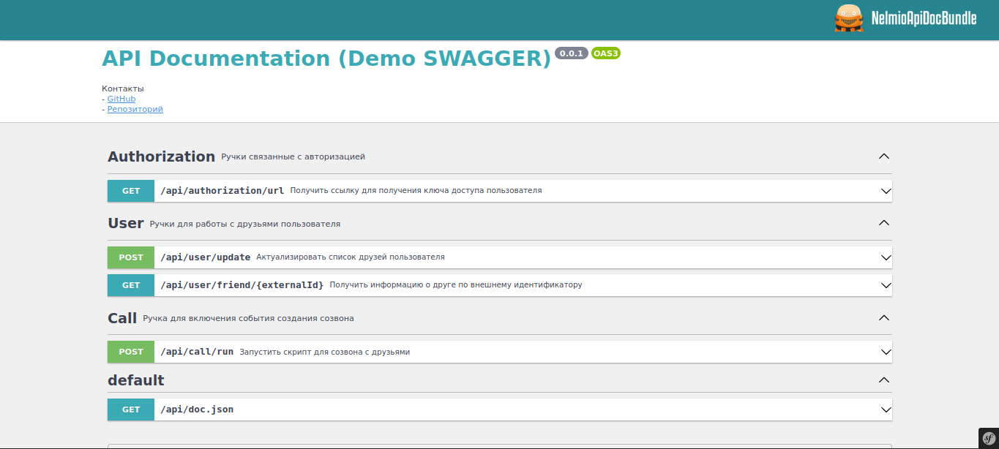
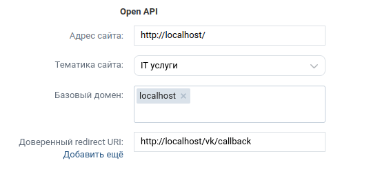
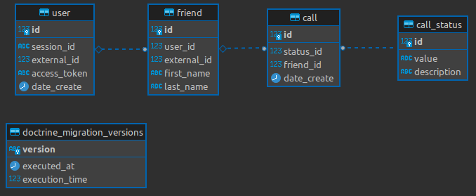

[](http://php.net/)
# VK "обзвон" друзей


### Технологический стэк

- PHP 8.1
- PostgreSQL 13
- Symfony 6.0
- RabbitMQ 3.11.2
- Docker

### Install

1. Создать файл **.env.local** с настройками (Для примера смотри файл .env.local.dist)

*Для получения значения VK_APP_ID ознакомься с разделом **Создание приложения VK**

2. Запуск
```bash
docker-compose up --build
```
3. Зайти в контейнер
```bash
docker exec -it app sh
```
4. Установить зависимости
```bash
composer ins
```
5. Загрузить миграции
```bash
php bin/console doctrine:migrations:migrate
```
6. Загрузить фикстуры
```bash
php bin/console doctrine:fixtures:load
```
7. Запустить воркер
```bash
php bin/console messenger:consume call_friend
```
8. Зайти в swagger по адресу http://localhost/api/doc

### Создание приложения VK

1. Создать *Standalone-приложение* на странице https://dev.vk.com/
2. После создания приложения настроить раздел *Open API* как на изображении ниже

3. Скопировать значение *ID приложения* и подставить его в env.local (VK_APP_ID)

### Как пользоваться

1. Дернуть ручку */api/authorization/url*, для получения ссылки авторизации
2. Скопировать сгенерированную ссылку и перейти по ней
3. Предоставить доступ к данным для приложения
4. Для запуска "обзвона" друзей дернуть ручку */api/call/run*

### Схема БД


### Примечание
Т.к. метод VK-API **getAvailableForCall** объявлен устаревшим, то скрипт просто выгребает друзей online (вместо метода getAvailableForCall) и выставляет статусы success для тех кто online и fail для тех кто offline.